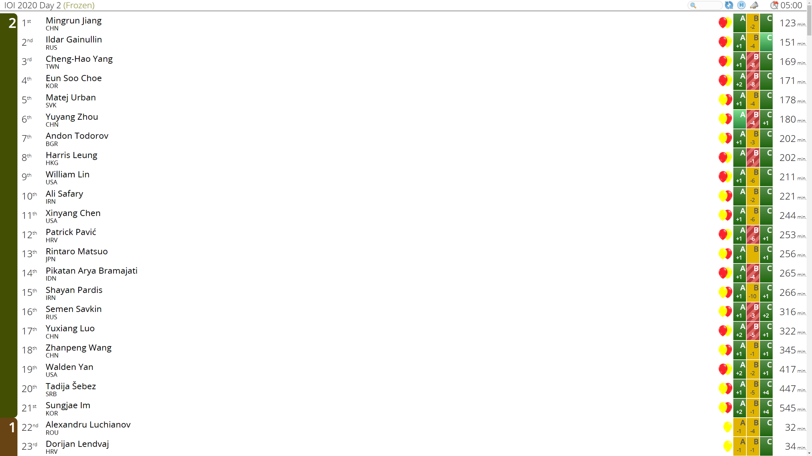

# cms-spotboard-converter

This converter generates `contest.json` and `runs.json` file for Spotboard using cmsRankingWebServer(CMS Scoreboard).<br>
It was tested with [IOI 2020 Official Scoreboard](https://ranking.ioi2020.sg/).

This project was inspired by [spotboard/domjudge-converter](https://github.com/spotboard/domjudge-converter).

# Warning
* **Do not support subtask**
* **cmsRankingWebServer must operate correctly**

# Requirements
* Node.js
* [CMS](https://github.com/cms-dev/cms) Scoreboard

# Configuration
[config.js](https://github.com/justiceHui/cms-spotboard-converter/blob/master/config.js)

# Install Package
```
$ npm install
```

# How to run
```
$ npm start
```

# Step-by-Step Guide (IOI Day2)
1. Install Spotboard & Converter
    * `$ apt install nodejs npm`
    * `$ git clone https://github.com/justiceHui/cms-spotboard-converter.git`
    * `$ wget -c https://github.com/spotboard/spotboard/releases/download/v0.6/spotboard-webapp-0.6.0.tar.gz`
    * `$ tar -zxvf spotboard-webapp-0.6.0.tar.gz`
    * `$ mv spotboard-webapp-0.6.0 spotboard`
    * `$ cd cms-spotboard-converter`
    * `$ npm install`
2. Configuration
    * `$ vim config.js`
    * `cms.scoreboard = 'https://ranking.ioi2020.sg'`
    * `cms.cid = 1`
    * `dest = '../spotboard/sample'`
3. Run Converter
    * `$ screen -S cms`
    * `$ npm start`
    * ctrl+A D
4. Run Spotboard
    * `$ cd spotboard`
    * `$ npm install -g http-server`
    * `$ screen -S spotboard`
    * `$ http-server -c-1`
    * ctrl+A D
    * Goto (Your IP):8080

